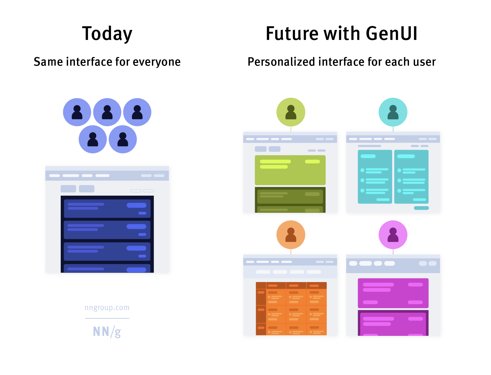

+++
date = '2025-06-21T11:01:53-05:00'
draft = true
title = 'Agents'
+++

- A generative UI (genUI) is a user interface that is dynamically generated in real time by artificial intelligence to provide an experience customized to fit the user’s needs and context.
- AI is introducing the third user-interface paradigm in computing history, shifting to a new interaction mechanism where users tell the computer what they want, not how to do it — thus reversing the locus of control.
- Personalized Interfaces
- Instead of one UI, there will be a Ui designed for each person
- UI will be created in real time
- Instead of designing components and buttons, UI design will focus on user goals and obey constraints
  

| |Generative UI|AI-Assisted Design|
|-|-------------|------------------|
|Who benefits?|End users|Designers and Product Teams|
|What is the output?|A dynamic, custom interface generated in real time for a specific end user|AI-generated UI designs and code| 
|What is the impact?|Every end user interacts with an interface built just for them and their needs in that moment.|Product teams can significantly accelerate the ideation, design, and implementation of interfaces|

- Some Early Tools
  - UIzard
  - Canonic
  - v0
-  
Generative AI tools (like ChatGPT, Claude, etc.) have deep-rooted usability problems. Their problems led to the development of a new role — the “prompt engineer.”, who do nothing but talk nicely to the LLM in order to the right results.

Micro-interactions convey system status, support error prevention, and communicate brand. They are initiated by a trigger, are single-purpose, and can make the experience engaging. 

