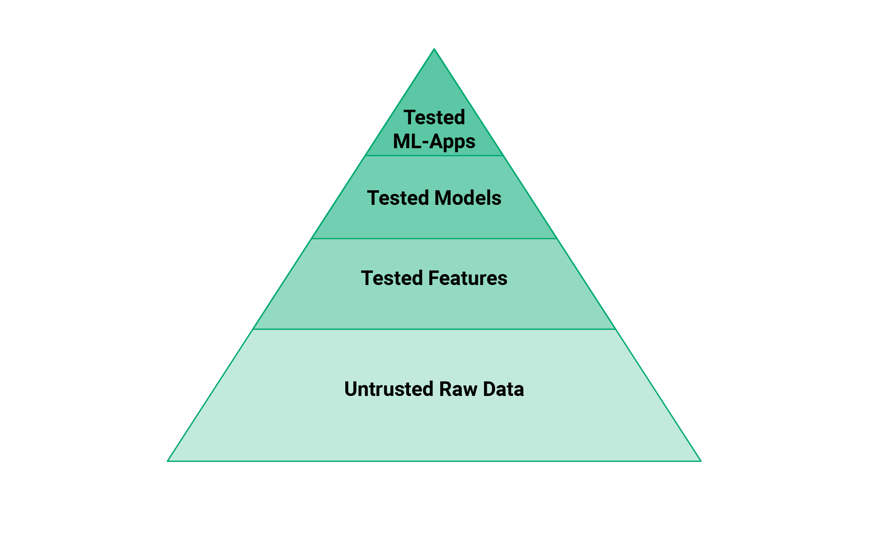
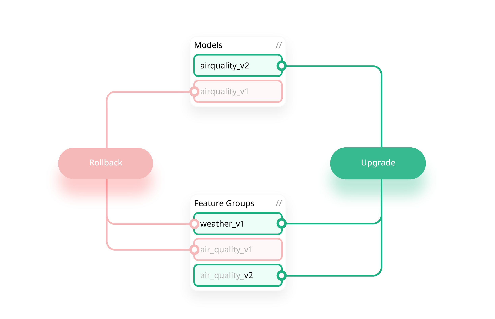

+++
title = 'ML Pipelines'
date = 2024-07-19T08:58:05-05:00
draft = true
+++

MLOps is about automated testing, versioning, and monitoring of ML artifacts.

()

It takes significant engineering effort to test and validate ML Systems  to make them safe!

The models need to be tested for performance, but also for a lack of bias against known groups of vulnerable users. Finally, at the top of the pyramid, ML-Systems need to test their performance with A/B tests before they can switch to use a new model.

## References

[From MLOps to ML Systems with Feature/Training/Inference Pipelines](https://www.hopsworks.ai/post/mlops-to-ml-systems-with-fti-pipelines)

[Serverless Machine Learning](https://www.serverless-ml.org/sml-course)

