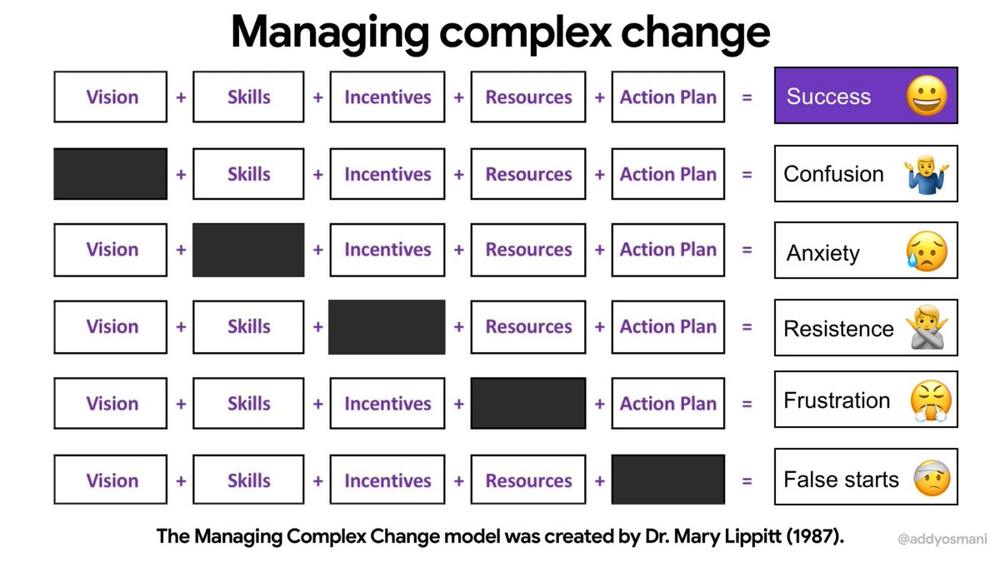
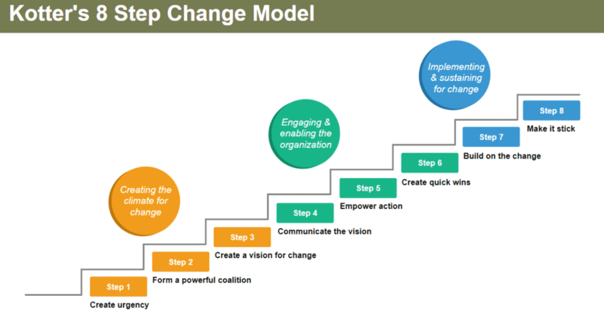

+++
title = 'Managing Complex Change'
date = 2024-07-06T08:50:13-05:00
draft = true
+++

# Lippitt-Knoster Model of Change Management

An organization needs 5 things in order to execute change successfully

1. Vision
2. Skills
3. Incentives
4. Resources
5. Action plan

If any of these items are missing, the consequnces are:
- Lack of vision: If you don’t have a vision — that guiding force behind what you’re trying to do — you will not end up with change. *You will end up with confusion* because you won’t have that guiding force to refer back to during the process.
- Lack of skills: If you lack the skills necessary (i.e. communication, public speaking, political or advocacy) to effect the change you seek, you will be left with anxiety among your coalition members. If you have people who are unprepared to do the work, it doesn’t matter if they have a great vision.
- Lack of Incentives: If you klack incentives (rewards, recognition, celebrations) that keep key community stakeholders involved — you may have change, but it may take years to accomplish what you could have done in a shorter period of time.
- Lack of Resources: If you the resources (money, time, equipment), you will end up with a lot of frustration because you don’t have the resources to get the job done.
- No Action Plan: If you don't have an action plan — a plan broken down into steps that people can take and accomplish in small bits — you will end up with a lot of false starts. A lot of time will be wasted to go back and take care of necessary steps.

## Resources

<https://www.kotterinc.com/methodology/8-steps//>

<https://www.crosscountry-consulting.com/insights/blog/managing-complex-change/>

<https://meyerfoundation.org/wp-content/uploads/2019/12/Managing-Complex-Change.pdf>
