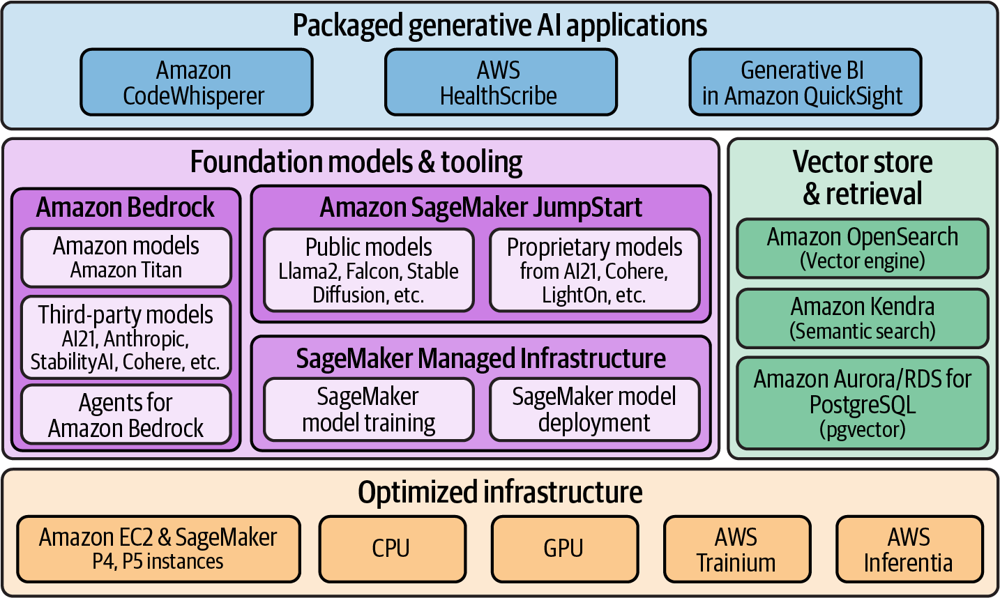

+++
title = '100 Questions to Test Your Knowledge of AWS AI Cloud Services'
date = 2024-03-05T08:50:13-05:00
draft = true
+++

100 Questions to Test Your Knowledge of AWS AI Cloud Services

Define these terms:

- Amazon Bedrock
  - Amazon Titan
  - Agents for Amazon Bedrock
  - Third party Bedrock models
- Amazon Sagemaker
  - Jumpstart
    - Public models
    - Proprietary models
  - Managed Infrastructure
    - Sagemaker model training
    - Sagemaker model deployment
- Amazon OpenSearch (k-NN plugin)
- Amazon Kendra
- Amazon Aurora/RDS for postgresSQL (pgvector)
- AWS Trainium
- AWS Inferentia
- Amazon CodeWhisperer
- AWs HealthScribe
- Generative Bi in Amazon QuickSight 
- 
When should you use:
- Copy list above
- 

Why use Bedrock

Explain what each of the follwoing AWS vector store services are and why you might use each of them
- Vector Engine for Amazon OpenSearch Serverless
- Amazon OpenSearchService (k-NN plugin)
- Amazon Aurora PostgreSQL (pgvector)
- Amazon Relational Database Services (RDS) for PostgreSQL (pgvector)
- Amazon Kendra

 Assess why you should use 
The ANSWERS:

Q: Why utilize AWS for your generative AI workloads?
A: Key benefits include:
- increased flexibility and choice
- enterprise-grade security and governance capabilities
- state-of-the art generative AI capabilities
- low operational overhead through fully managed services
- ability to quickly get started with ready-to-use solutions and services
- a strong history of continuous innovation.